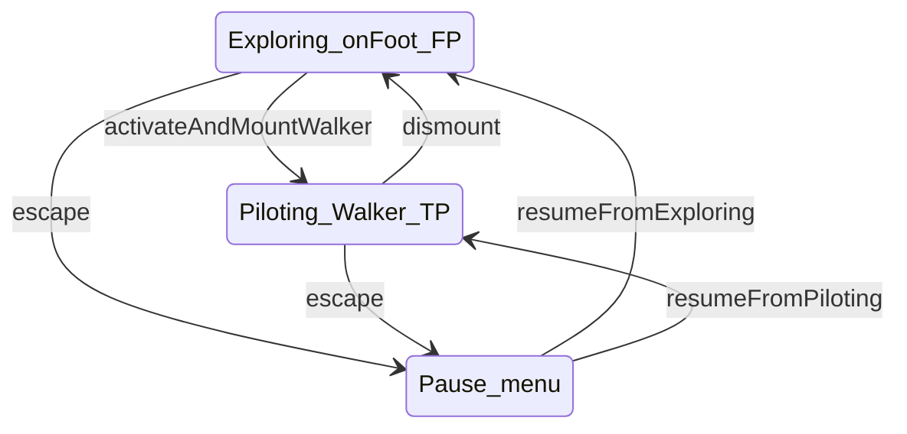

# Game state transitions (planned vs current)

## Current behavior

- **`Game.ts`** registers **`ExploringState`** and **`PilotingState`**. Pause is still a `paused` flag + `PauseMenu` (no `MenuState` class).
- **`mountWalker` / `dismountWalker`** on `GameContext` switch between exploring and piloting.

## Target transitions

When piloting and menu states are implemented, transitions should look like this:

## GameContext extensions (likely)

The existing [`GameContext`](../src/game/GameState.ts) already passes `player`, `cameraRig`, `walkers`, `hud`, etc. Piloting will probably need:

- **`activeWalker: WalkerMech | null`** (or index) — which machine is mounted.
- **Interaction / combat** — ray or radius for “use” prompts; optional `EnemySystem` reference for turret lock-on.
- **`requestStateChange`** — already on context; ensure piloting and exploring agree on who owns Walker root motion (player position vs Walker `object3d`).

Keep **environment updates** (sky, water, `walkers.update` for idle animation) in `Game.ts` unless a state needs to pause the world.

## Pause vs menu state

Two valid approaches:

1. **Keep boolean pause** (current): simpler; ESC does not call `changeState('menu')`.
2. **`MenuState`**: `enter` sets pause, `exit` resumes; centralizes input handling for overlays.

Document whichever the project adopts in `architecture.md` when implemented.
